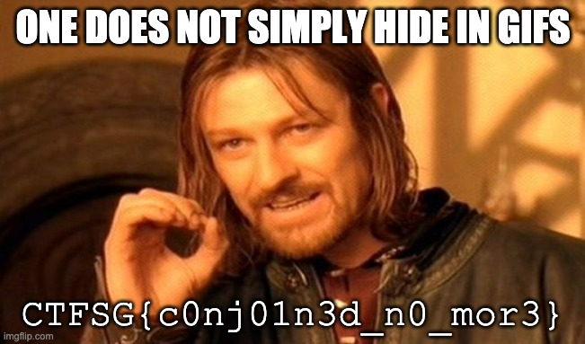

# conjoined

## Description
There is a JPG image hidden in this GIF, can you retrieve it?

## Analysis
Description indicates we need to extract files from the GIF so let's talk a little walk around the binary to see what we can find.

```shell
$ binwalk conjoined.gif 

DECIMAL       HEXADECIMAL     DESCRIPTION
--------------------------------------------------------------------------------
0             0x0             GIF image data, version "89a", 330 x 186
2173699       0x212B03        JPEG image data, JFIF standard 1.01
```

Well, well, well. That was fairly easy to find.

## Solution

To obtain the hidden JPG we just need to now extract the image.

```shell
$ binwalk -e conjoined.gif
```

Hmm.. It doesn't work? Maybe ``binwalk`` doesn't automatically extract the image? [A quick search on StackOverflow later](https://stackoverflow.com/questions/37904544/binwalk-not-extracting-files-from-binary), we now we need to allow ``binwalk`` to extract any file type. Lets try again with this new knowledge.

```shell
$ binwalk --dd=".*" conjoined.gif
```

Alternatively, we could just run this script to extract the image since we already know where the JPG file starts:
```py
with open("conjoined.gif", "rb") as f:
    data = f.read()

with open("seperated.jpg", "wb") as f:
    f.write(data[2173699:])
```

Both methods work to give us our image:


```txt
CTFSG{c0nj01n3d_n0_mor3}
```