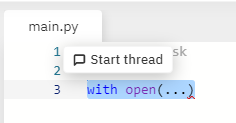

# Task format

This task is adapted for HBL use, and can be done in replit.com.

If you are working on a task:

1. Work inside the folder with your name, so that you do not overwrite other peoples' files.
2. Name your files `<Task>_<Name>.py` inside your folder (similar to exam format)
3. Separate each subtask with labelled comments (i.e. `# Task 1.1`)

**Revision guides**: you can use the thread feature in replit to post comments on sections of your revision group members' code.

Just select the relevant section of code and click "Start thread" on the popup that appears:

# Revision overview

The following text files contain information about Singapore's weather:

- `rainfall-monthly-highest-daily-total.csv`: The highest daily total rainfall for the month recorded at the Changi Climate Station
- `rainfall-monthly-number-of-rain-days.csv`: The number of rain days (day with rainfall amount of 0.2mm or more) in a month recorded at the Changi Climate Station
- `rainfall-monthly-total.csv`: The total monthly rainfall recorded at the Changi Climate Station
- `relative-humidity-monthly-mean.csv`: The monthly mean relative humidity recorded at the Changi Climate Station
- `surface-air-temperature-monthly-mean.csv`: The monthly mean air temperature recorded at the Changi Climate Station

Each line in the text files is in the following format:

    YYYY-MM,<value>

- The date is in the form YYYY-MM, for example 1982-01 is the month of January in 1982
- For values:
  - Temperatures are given in units of degree Celsius
  - Rainfall is given in units of millimetre
  - Rain days are given in units of days
  - Relative humidity is given in units of %

## Common Task

Write program code to:

- read in the weather data from each text file

# Task 1: CSV

## Task 1.1

Write program code to:
- merge the data from each text file into an appropriate single data structure
- write all the data to a csv file with the first column in `YYYY-MM` format, followed by one column for each weather data type

## Task 1.2

Write program code to:
- print the highest total rainfall for each year, and the month in which it occurs
- print the highest daily total rainfall for each year, and the month in which it occurs
- print the highest number of rain days for each year, and the month in which it occurs
- print the highest relative humidity for each year, and the month in which it occurs
- print the highest mean surface air temperature for each year, and the month in which it occurs

## Task 1.3

Write program code to:
- print the year with the highest total rainfall
- print the year with the highest daily total rainfall
- print the year with the highest number of rain days
- print the year with the highest relative humidity
- print the year with the highest mean surface air temperature

## Task 1.4

Write program code to:
- print the difference between highest and lowest total rainfall for each year
- print the difference between highest and lowest daily total rainfall for each year
- print the difference between highest and lowest number of rain days for each year
- print the difference between highest and lowest relative humidity for each year
- print the difference between highest and lowest mean surface air temperature for each year

# Task 2: Flask

## Task 2.1

Write a Python program and the necessary files to create a web application that enables users to select data to display.

The web page should include a web form that prompts the user to enter the type of data to retrieve. User input should be validated to ensure the input is a valid choice, otherwise an error message should be displayed.

- `rainfall` to display total rainfall and daily total rainfall
- `raindays` to display rain days
- `humidity` to display relative humidity
- `temperature` to display temperature

## Task 2.2 (with CSV/SQL)

Modify your program to use `csv`/`sqlite` as the data source, depending on the assigned revision task

## Task 2.3 (with Task 1.2)

Modify your program so that when the user inputs `highest`, the web application displays the results from Task 1.2

## Task 2.4 (with Task 1.4)

Modify your program so that when the user inputs `difference`, the web application displays the results from Task 1.4

# Task 3: SQL

## Task 3.1

Write SQL code to create a database `weather.db` with three tables: `Temperature`, `Rain`, and `Humidity`.

Each table will have the following column:
- `year-month`: year and month in the following format: `YYYY-MM`
- `year`: year in the format `YYYY`
- `month`: month in the format `MM`

The `Temperature` table will have the following additional column:
- `temperature`: mean surface air temperature for the month, in deg C

The `Rain` table will have the following additional columns:
- `total`: total rainfall for the month
- `max_daily`: the highest daily total for the month
- `days`: number of rain days for the month

The `Humidity` table will have the following additional column:
- `relative`: mean relative humidity for the month

## Task 3.2 (with CSV)

Write program code to insert data from the `csv` files into the SQL tables from Task 3.1

## Task 3.3

Write SQL code to query the database for temperature, rain, and humidity data for the year `2020`

# Task 4: Object-Oriented Pogramming

## Task 4.1

Python programming language and object-oriented programming will be used to implement a standard interface for the data.

The class `Record` will store the following data:

- `year` - a **private attribute** stored as an integer
- `month` - a **private attribute** stored as an integer

The class has the following methods defined on it:

- `year()` - returns the year as a string in `YYYY` format
- `month()` - returns the month as a string in `MM` format
- `before(record)` - returns `True` if `record` comes before the current record chronologically, otherwise returns `False`
- `after(record)` - returns `True` if `record` comes after the current record chronologically, otherwise returns `False`
- `as_record()` – returns a tuple of values in the same order as the SQL table column order

The subclasses `Temperature`, `Rain`, and `Humidity` inherit from `Record`, such that:

- each weather value is stored as an attribute with an apporpriate name
- they implement `from_record(dict|tuple)`: a **class method** that takes in a `tuple` of values, and returns an instance of the appropriate subclass
- the `as_record()` method returns the appropriate values for the subclass
- When initialised, they carry out any appropriate data conversion (from `str` type)

Implement the above superclass and subclasses.

## Task 4.2 (with CSV, SQL)

Write program code to insert data from the `csv` files into the SQL tables from Task 3.1, using the appropriate subclass to carry out data conversion.

## Task 4.3 (with Task 2.2)

Carry out Task 2.2, but using only the subclasses to carry out data conversion. Attributes should be accessed through the appropriate method instead of being direct accessed.

# Task 5: Algorithms and Data Structures

## Task 5.1 (with OOP)

*Requires Task 4.1

Implement a sort algorithm (bubble/insertion/merge/quick sort) that takes in an array of **subclass instances** and returns the array sorted in **descending** order.

## Task 5.2 (with OOP)

Implement a linkedlist class with the following methods:

- `append(element)`: adds an element to the tail of the linkedlist
- `insert(index, element)`: inserts an element at `index` in the linkedlist; raises `IndexError` if `index >= linkedlist.count`
- `pop(index)`: removes an element from `index` in the linkedlist and returns it; raises `IndexError` if `index >= linkedlist.count`

The linkedlist class should maintain the following attributes:

- `head`: references the head node if there is one, otherwise `None`
- `tail`: references the tail node if there is one, otherwise `None`
- `count`: integer representing the number of elements in the linkedlist

Test your linkedlist by using it in Task 5.1

## Task 5.3 (with OOP)

Implement a hashtable that stores the year-month (in `YYYY-MM` format) as the key, and the subclass instance as the value.

The hashtable should have the following methods:

- `add(element)`: adds an element to the hashtable (each element is an instance of a subclass)
- `remove(key)`: remove the key and value corresponding to `key`
- `contains(key)`: returns `True` if `key` is in the hashtable, otherwise return `False`

The hashing function should return the hash index using the following algorithm:

1. Remove the hyphen (`-`) from the year-month
2. Convert the result to integer form
3. e.g. `'1989-05'` becomes `198905`

